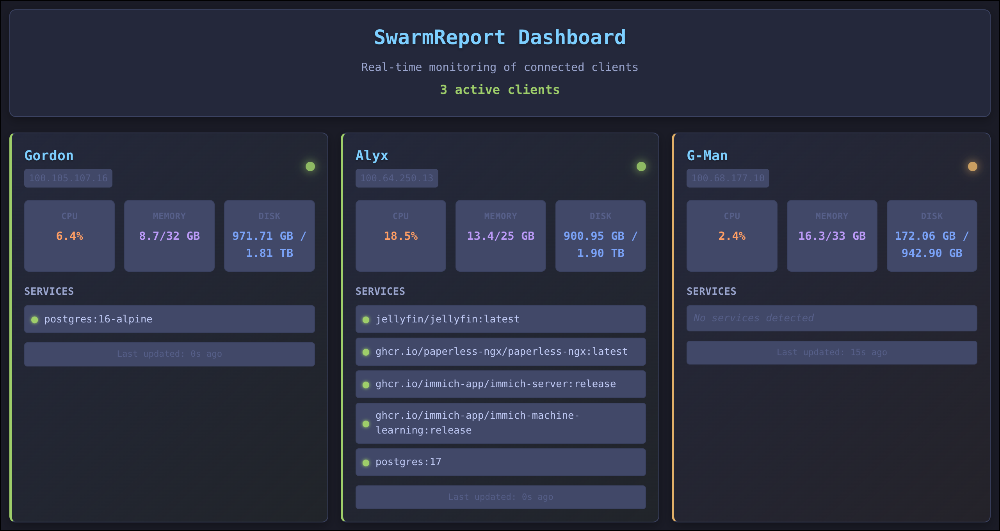
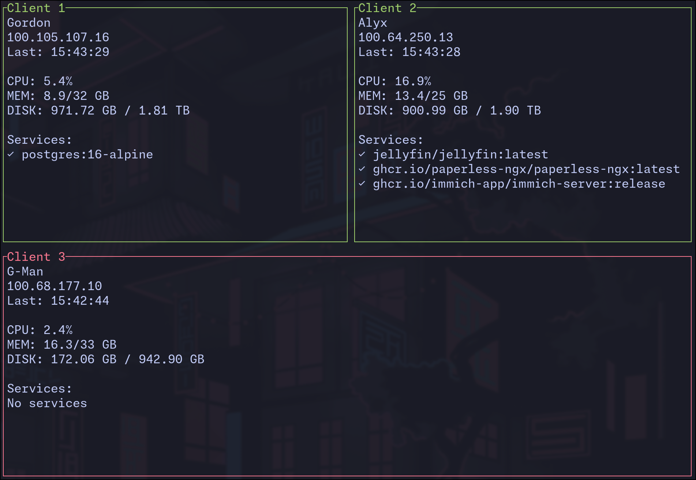

# 🚀 SwarmReport

**Real-time system monitoring for distributed environments**

> ⚠️ **Early Development**: This project is in active development. APIs and features may change.

SwarmReport is a lightweight, real-time monitoring solution that collects system metrics from multiple machines and displays them through both a terminal interface and web dashboard. Perfect for monitoring Docker swarms, server clusters, or any distributed system.

## ✨ Features

- **📊 Real-time Monitoring** - Live system metrics (CPU, memory, disk usage)
- **🐳 Docker Integration** - Automatic detection of running containers
- **🖥️ Dual Interface** - Terminal UI and web dashboard
- **🌐 Network Aware** - Tailscale integration for seamless networking
- **⚡ Lightweight** - Minimal resource footprint
- **🔄 Auto-cleanup** - Automatic removal of offline clients

## 🖼️ Screenshots

### Web Dashboard


### TUI


### Terminal Interface
The TUI provides a real-time grid view of all connected clients with color-coded status indicators:
- 🟢 **Green**: Recently updated (< 5s)
- 🟡 **Yellow**: Normal (5-30s)
- 🔴 **Red**: Stale (> 30s)

## 🚀 Quick Start

### Prerequisites
- Rust 1.70+ 
- Protocol Buffers compiler (`protoc`)

### Installation

1. **Clone the repository**
   ```bash
   git clone https://github.com/MarkusZoppelt/swarmreport.git
   cd swarmreport
   ```

2. **Build the project**
   ```bash
   cargo build --release
   ```

3. **Start the sentinel server**
   ```bash
   ./target/release/sentinel
   ```
   The server will start on:
   - gRPC: `0.0.0.0:50051`
   - Web dashboard: `http://localhost:6969`

4. **Run reporters on client machines**
   ```bash
   # Optional: Set custom sentinel address
   export SWARM_SENTINEL_ADDR="http://your-sentinel:50051"
   
   ./target/release/reporter
   ```

## 🏗️ Architecture

```
┌─────────────────┐    gRPC     ┌─────────────────┐
│   Reporter      │ ──────────► │    Sentinel     │
│   (Clients)     │             │    (Server)     │
└─────────────────┘             └─────────────────┘
                                         │
                                    ┌────┴────┐
                                    │   TUI   │
                                    │   Web   │
                                    └─────────┘
```

- **Reporter**: Lightweight client that sends system metrics
- **Sentinel**: Central server that aggregates and displays data
- **Interfaces**: Terminal UI for operators, web dashboard for teams

## 📊 Metrics Collected

- **System Info**: Hostname, IP address, OS details
- **Performance**: CPU usage, memory consumption
- **Storage**: Disk usage across all mounted drives
- **Services**: Running Docker containers with status
- **Network**: Tailscale IP detection when available

## 🔧 Configuration

### Environment Variables

| Variable | Description | Default |
|----------|-------------|---------|
| `SWARM_SENTINEL_ADDR` | Sentinel server address | `http://localhost:50051` |

### Network Setup

SwarmReport works great with Tailscale for secure networking across machines:

1. Install Tailscale on all machines
2. Reporters will automatically detect and use Tailscale IPs
3. Set `SWARM_SENTINEL_ADDR` to your sentinel's Tailscale address

